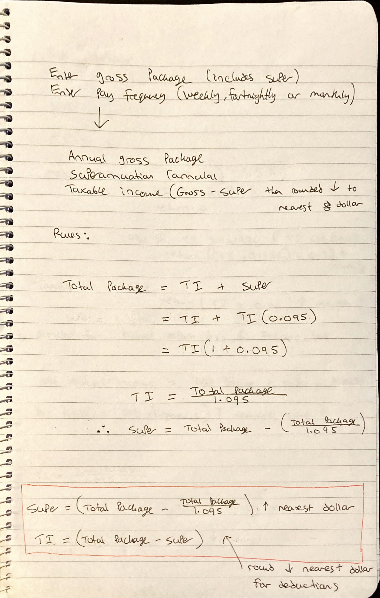
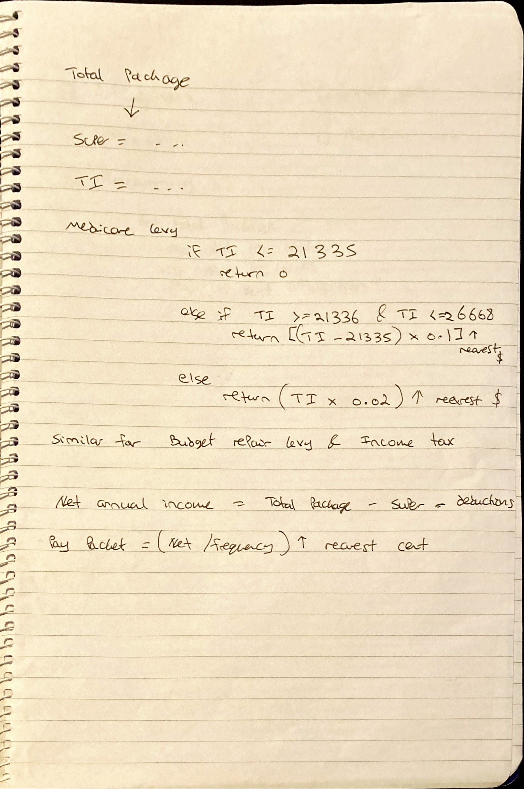
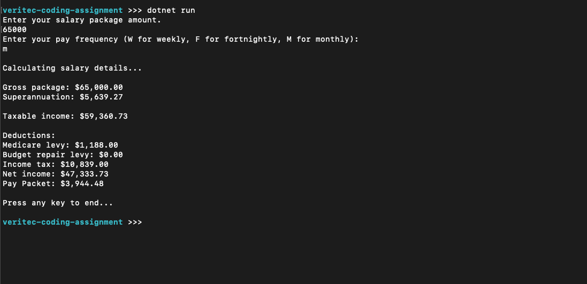

# Tax Calculator

## The task (as part of a coding assignment):
Create a C# Windows console application that allows a user to enter a gross salary package and a pay frequency and then show them a breakdown of this salary and what their pay packet will be.   
**Note:**  
The solution provides a multiplatform console application by using .NET Core, rather than Windows specific console application.

## Example
Enter your salary package amount: **65000** 
Enter your pay frequency (W for weekly, F for fortnightly, M for monthly): **M**

Calculating salary details...

Gross package: $65,000 
Superannuation: $5,639.27 
Taxable income: $59,360.73 

Deductions: 
Medicare Levy: $1,188.00 
Budget Repair Levy: $0 
Income Tax: $10,839.00 
Net income: $47,333.73 
Pay packet: $3,944.48 per month 
Press any key to end...

## Approach

### 1. Understand the problem
Read and re-read the instructions, make scrap notes to help process the information. Figure out ahead of time how I'll handle the calculations.
I found it difficult to understand how to do the calculations from disparate pieces of text on a page, so I used algebra to represent the same information in a more concise manner:

### 2. Method
This was a combination of **breaking the problem down** while thinking about the best way forward.
For this application I didn't feel that the use of Classes would be required, so I focused on writing multiple small & specific methods.
This page of scrap notes shows how I planned to handle the Medicare Levy method, while noting other deductions would be similar.

This left only user input as the last major problem to solve.

## Considerations

### User Input:
User input is provided as a string by default.
To handle non-numeric characters being passed into the string, the solution utilises a try/catch block.
If the string can be converted to a double, the program will first ensure the value is greater than or equal to 0 before continuing (as negative salaries also aren't valid).  
Otherwise the user is provided an informative error message, with a technical error message for IT if needed, before prompting the user again.

### Application should format values as currency
To achieve this, after calculations were performed, the CultureInfo class from the System.Globalization namespace was used.

### Encapsulation
The ***public*** keyword was used to allow access to the methods from other classes if needed.
The ***static*** keyword was used to assign the methods to the class itself, as instances of the class were not used in the solution.

### Code class structure including interfaces, abstract classes, etc. if appropriate
Not used.

### Handling of user input errors/Exception handling
Performed in:
- **GetTotalPackage()** using a try/catch block to ensure the string input can be converted to a double; in conjunction with an if/else statement to ensure the value is greater than or equal to 0.
- **GetPayFrequency()** using the Contains() method to ensure the string passed in is one of the valid 3 options and accounts for lowercase values being passed in.

### Readability and maintainability
All efforts were made to conform to established C# formatting and casing and reduce use of literal values where possible.

### Comments (useful ones)
Some people say "comments are lies waiting to happen". I think this is a valid concern, though no comments sacrifices readability. To that end, I tried to keep comments short and concise, and avoid using them when the functionality of the code is particularly obvious.

### Coding design patterns
Not used.

### Separation of concerns
For such a simple application with no UI, database or other considerations, the architecture amounted to purely business logic contained in methods used for distinctly separate tasks.

### Ability to extend and handle changes in tax laws
The solutions allows for modification of existing methods to, for instance, change the various tiers in CalculateTaxableIncome(); or to add new methods as needed.

## Result
The below image shows the result of entering 65000 as the total package and "m" as the pay frequency.

## Final Thoughts
I'm still very new to the world of Software Development and this was my first coding assignment.  
It provided a great opportunity to further familiarise myself with C# syntax and more thoroughly handle user-input errors than I've done in the past.  
I also learned about formatting numbers as currency and the Console.ReadKey() method, and gained experience in a wide range of programming fundamentals such as control flow and exception handling.  
Undoubtedly there will be areas for improvement, and I'm looking forward to hearing feedback from those more experienced :)

